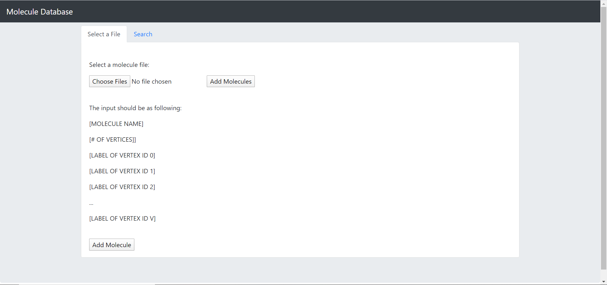

# EC504-Molecule-database
# Final Project Implementation 
# Molecule_Database Description:
Our project aims to present a molecule database, which stores structural properties and elemental composition of molecules. The project will be finished with the ability to efficiently handle at least 10,000 molecules and the ability to efficiently search for a given molecule up to graph isomorphism. A user-friendly web-based command-line interface and an Android client will be established to support the above functions.

# Team 2
## Group Members:
* Chenhui Zhu (zhuch@bu.edu)
* Peixi Zhao (bradzhao@bu.edu)
* Suli Hu (sulihu@bu.edu )
* Jinyu Tian (jinyutn@bu.edu )
* Xushan Hu (huxushan@bu.edu)

## Basic Functionality 
### Overview
We store our molecules in a Hashmap data structure, because of it’s features of quick adding and quick searching. Each key within the Hashmap is stored using a multigraph with each key-value pair stored in the database through a built-in “put” function. We have a pre-compiled database of 10,000 molecules (gathered from Pubchem) stored on 10,000 text files and then assembled them to  a csv file, which is our mainly database.That the user can pre populate the hashmap from. If the user would like to start with a different dataset, they can rewrite part of the csv file or import one from a local directory. We have written Java functions to add compounds, search for compounds, and perform a subgraph search (revealing which compounds contain a specific subgraph, used as an input parameter in the function). A user has the ability to interact with the database via a command-line-interface or an Android Client or a Web Interface.

For subgraph search, one of the hardest challenges in this project. Graph isomorphism occurs when a given Graph G1 has a one to one mapping of nodes to another Graph G2, i.e in our case when molecules have the same graph structure even then their text representation is different. In order to solve this problem we also utilized Hashmap. The key of the hashmap is the molecule property and the value is a direct weighted graph which stores the chemical bond of a molecule. In the graph, the vertices are atoms which construct the molecule, the weighted edges are the chemical bonds with weight representing bond number between two atoms. To assist in the efficiency of this method we apply pruning to the Database when doing subgraph search. This pruning included matching the number of unique elements , the number of Atoms, number of Bonds and Weight of Bonds before the recursive algorithm using back-tracking is called with.This implementation is great due to its early detection and quit abilities, optimized backtracking, and satisfaction of Neighbor Compatibility. This algorithm is very efficient and overall has very similar performance to the advanced algorithms such as Ullman and VFT.

## Additional Feature Implementation:

### Download 1,000 known compounds from an existing database (e.g., [http://www.chemspider.com/AboutServices.aspx?][ChemSpider]]) into your molecular database. [5%]
PubChem is a freely available database of chemical structures of small organic molecules and information on their biological activities. We chose the PubChem API to we created the HttpURLConnection object to connect with URL as PubChem URL format. We pulled the data in a JSON format and used compound identifier(CID) as the input portion. The data is iterated through a for loop and increase ID by one each time until getting 1000 compounds.

### Develop a web page and corresponding server-side executable for accessing the database. [5%]
We used html+javascript to design a web user interface, which has two pages: Add and search. Using Servlet and JSP to pass the text entered into an HTML text box to a Java method(passing .txt file).

### Develop an Android client for your database. [5%]
For the Android Client, we developed it on Android Studio. Firstly, we packed the finished java code into a java module and added it to the Android Studio Application. We packaged the java module into a “black box”, which means we will only use the input and output of the module in the MainActivity of the application. The csv file and text file, which are the database and input data, are stored in the assets file folder, which can be read and written by MainActivity without using out storage. We use Button, EditText,TextView to finish the logic of our Application, which is: User editing the text content of EditText1 which is actually the molecule name to be searched and shows in the form of a search box on the layout. Then the user presses Button1, which means pass the parameter of the search function and call this function. Finally the result of the search function will be shown on the screen by TextView1. The add function is similar that EditText2 represents the name of the molecule to be added and by text content of EditText2 we can find the file that stores the property of this molecule. Then Button2 converts the parameter and calls the addFunction and TextView1 shows the result in the end. For the layout/UI design, we simply put all of these two functions into the same page and it seems a little crowded. If time allows, we can add more functions such as reducing the molecular structure diagram on the screen and etc.

### Implement subgraph search - finding all molecules(Gs) that contain a subgraph(SG) provided [10%]
For subgraph search, firstly we use a hashmap which store the molecule property as the key and the actual graph of the molecule as the value. And we compare the subgraph molecule with each molecule's property which we store in our database. The property include the type atoms in the graph, the number of atoms in the graph,  the number of edges in the graph. Then we select some molecule which the property is the same or contain the property of the subgraph. Then for these selected molecule, we use a contain function to find if the big graph contain the subgraph. We recursivly go through each node of the two graph, and compare if it's the same atom, if they are the same atom, and then we compare the edges of the atoms. If the edges is the same, then go to next atom of the subgraph. If we successfully go through the whole subgraph, then we will know the subgraph is the subgraph of the big molecule graph.

### The following additional features have been removed from our Midterm Status Report:
We finished all future plans of our MidtermStatusReport. But we have to improve our webpage functionality.

## References: 
[1] Givaudan Schweiz AG, 2013 Dec 11. Molecule database framework: a framework for creating database applications with chemical structure search capability. Journal of Cheminformatics.
Explanation: The involved scientists must be able to store this data and search it by chemical structure. We refer to the chemical structure of that model.

[2] Kun-Yi Hsin, Hugh P. Morgan, Steven R. Shave, Andrew C. Hinton, Paul Taylor, and Malcolm D. Walkinshaw*, 2010. EDULISS: a small-molecule database with data-mining and pharmacophore searching capabilities. Nucleic Acids Research.
Explanation: This article presents the relational database EDULISS (Edinburgh University Ligand Selection System), which stores structural, physicochemical and pharmacophoric properties of small molecules. We will reference the algorithms they use.

[3] Bc. Karol Kružel, 2008. Effective algorithms for searching for identical molecules and their application.
Explanation: Molecules are in computers usually represented in the form of molecular graphs. This work starts with the definition of all required terms and then the problem of graph isomorphism is briefly described. We refer to the backtracking method to search for our molecule.

[4] Sunghwan Kim, Jie Chen, Tiejun Cheng, Asta Gindulyte, Jia He, Siqian He, Qingliang Li, Benjamin A. Shoemaker, Paul A. Thiessen, Bo Yu, Leonid Zaslavsky, Jian Zhang and Evan E. Bolton. 2019. PubChem 2019 update: improved access to chemical data.
Explanation: PubChem is a key chemical information resource for the biomedical research community. It enables the function of Molecules name search and Isomers search, which is needed in our project. We will use PubChem to learn how to enable these functions.

[5] Alan Gibbons, Algorithmic Graph Theory. Cambridge University Press, 1985.
Explanation: As the requirement, molecules will be represented as an undirected multigraph without self-loops, whose vertices are labeled. In chemistry, a set of atoms combined with designated bonds are used to describe chemical molecules. Our project will store the chemical bonds of a module in a graph and store all of the graphs into a graph database. This reference is a textbook on graph theory, so we will use it to learn how to build the graph. database.

[6] Karam Gouda, Mosab Hassaan, A Fast Algorithm for Subgraph Search Problem.
Explanation:Explanation: After building the graph database abovementioned, we aim to finish a function with which users can do subgraph query: Users input a query graph, we will find the modules containing matching subgraph in our graph database and return them.

[7]https://getbootstrap.com/docs/4.4/getting-started/introduction/
Explanation: We decided to use the bootstrap framework to design UI. Here is a quick start on the website.
## Code:
All complete, working Java code used in our implementation. 
All data needed by our project to run (or a simple, publicly accessible link thereto).
All testing code utilized to observe the correctness of our code.
The whole system are in the BitBucket.
## Work Breakdown
* Suli Hu
	- Wrote command line interface. 
  	- Implemented MolecularProperty() class.
	- Most similar search function: look for 4 cases to find the most similar molecule given an input molecule file
  	- Designing the graph data structure implementing MoleculeGraph() class.
  	- Implemented graphMatch() class.
* Peixi Zhao
  	- Designing the graph data structure implementing MoleculeGraph() class.
  	- Implemented graphMatch() class.
 	- Researched and implemented findSubgraph() Method. 
  	- Wrote Install.txt.
* Chenhui Zhu 
	- Wrote test cases for main and put in formatting for test cases
  	- Built the data structure framework (layered HashMap)
	- Implemented add_Molecule() Method. 
	- Implemented find_Molecule() Method.
	- Wrote a bunch of Error catching constraints. 
* Jinyu Tian
	- Worked on setting up an Android-app to add and search for molecules and finishing these functions(not implemented in final program).
  	- Assisted in designing data structure for the prototype.
  	- Assisted in building the data structure framework.
  	- Wrote Readme.md
* Xushan Hu
	- Worked on setting up a web-app to add and search for molecules (not implemented in final program), it can add multiple .txt files of molecule locally to database.
  	- Finished downloading 1,0000 known compounds from an existing database (we used Pubchem) into our molecular database.
 	- Wrote a bunch of Error catching constraints.
  	- Wrote Readme.md
# Screenshot of Output

## Web App Interface

## Android App Interface
	- Main page:
	

	- Before we add the molecule 'acylene' to the database, we can not find the molecule 'acylene':
	

 	- Add molecule ‘actylene’ to the database.
	

	-After adding molecule 'actylene' to the database, we can find actylene and can see the molecule property on the screen.

